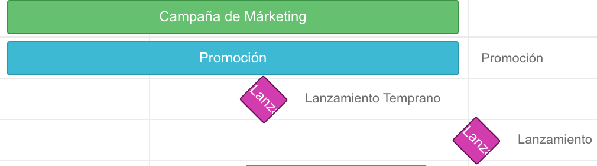

# Gantt
_Online Gantt Chart for a better planning._

Using [dhtmlxGantt](https://dhtmlx.com/docs/products/dhtmlxGantt/) library. Free support for milestones.

Export to *PDF*, *PNG*, *Excel*, *iCal* and save as *JSON* to load and edit in the future.

Collaborators are welcome via pull-request.

## ¿Qué es un diagrama de Gantt?

El *diagrama de Gantt* es un esquema visual en el que podemos observar de forma general las etapas de un proyecto y la duración de cada etapa, útil para planificar y prever cuando se tiene previsto terminar el proyecto o una parte de este, y para observar el progreso en un momento determinado.

## ¿Qué herramientas podemos usar?

Para *prototipado* rápido y para diagramas sencillos podemos usar esta herramienta. Más abajo se detalla un ejemplo de uso.

Otra opción es usar una hoja de **Excel** o **Google Spreadsheets** usando una tabla y un gráfico de barras. Para diagramas con más complejidad o para hacer seguimiento de tareas es preferible utilizar herramientas más avanzadas. Algunas herramientas específicas para este tipo de diagramas son **GanttProjct**, **Gantter** o **Microsoft Project**. Algunos servicios como **Asana**, **Trello** o **Coda** proporcionan sus propios calendarios que relacionan las tareas con su representación en calendario o como diagrama de Gantt, lo que permite tener una mayor trazabilidad.

## Creando un diagrama sencillo

Si no necesitamos trazabilidad de tareas y solo queremos hacer un diagrama sencillo podemos usar la página [https://carleslc.me/Gantt/](https://carleslc.me/Gantt/), con el que obtendremos un resultado como el que se muestra a continuación.

 para visualizarlo mejor](images/resultado.png)

Cuando accedemos a la página nos encontramos con nuestro espacio de trabajo, con diferentes opciones para poder crear nuestro diagrama:

Para añadir una **tarea** pulsaremos en el "**+**" de la parte izquierda de la página, donde se mostrará el *árbol de tareas y proyectos* con sus fechas de inicio y duraciones.

Cuando pulsamos en el "+" nos aparece una ventana para rellenar la información de nuestra tarea.

Añadimos una pequeña descripción como **título** (Description) de la tarea y le damos a guardar (Save). Las **fechas** de inicio y final las podemos especificar ahora o más tarde, *estirando* la tarea arrastrando desde sus laterales.

Aquí consideraremos un **proyecto** como un conjunto de tareas, y se muestra en el diagrama de color verde. Sirven para mejorar la visualización de etapas más generales. Las tareas se muestran en color azul. Podemos crear un proyecto añadiendo subtareas, como se muestra en el gráfico siguiente.

Puedes **editar** una tarea haciendo *doble click* sobre ella.

Si quieres, puedes especificar **dependencias** usando flechas, mediante los círculos a los laterales de las tareas.

Puedes definir *milestones* a la hora de crear una tarea. Esto son **objetivos**, y se muestran en morado.

Puedes modificar el **zoom** del diagrama para verlo de forma más global. Hay tres niveles de zoom: semanal, mensual y anual. Así queda el diagrama en visualización anual:

La opción *"Show Today"* te permite señalar dónde nos encontramos actualmente.

A la hora de añadir tareas puedes usar la opción *"Preference" Consecutive / Parallel*, para añadirlas después de la anterior o debajo de forma solapada. Las funciones *Indent / Outdent* son para añadir tareas existentes a proyectos o para sacarlas de un proyecto. Puedes mover tareas desde el árbol de tareas y también puedes **seleccionar** más de una tarea a la vez manteniendo pulsado *Shift* o *Control*.

Las opciones "Expand Task/Project Titles" sirven para añadir el título de la tarea o proyecto al lado, para verse incluso si por el zoom o la duración de la tarea el título queda cortado.

En la siguiente imagen hemos marcado la opción "Expand Task Titles".

También puedes cambiar el **estilo** del diagrama.

Cuando hayas terminado, puedes **exportar** el diagrama en varios formatos (PNG, PDF, Excel o iCal). El formato **iCal** sirve para añadirlo a un calendario existente como el de Google Calendar.

Para poder **guardar** el diagrama y **editarlo más tarde** utiliza la opción "**Save**" arriba de la página y luego haz click en "**Download**". Esto descargará un documento en formato JSON que podrás cargar usando la opción "Load" cuando vuelvas más tarde a esta página.

